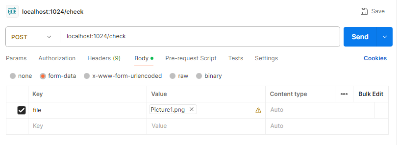

# Описание API

---

### POST `/check`

---

#### Описание

```
Возвращает список зон особенностей по присылаемому в теле запроса файлу изображения,
либо пустой массив, если особенностей не выявлено
```

#### Поддерживаемые форматы изображений

```
BMP, CUR, DDS, GIF, HEIC (HEIF, AVCI, AVIF), ICNS, ICO, J2C, JP2, JPEG,
KTX (1 and 2), PNG, PNM (PAM, PBM, PFM, PGM, PPM), PSD, SVG, TGA, TIFF, WebP
```

#### Структура тела запроса

Сервис получает файлы как `multipart/form-data`, для чего в теле запроса должно быть полу `file`
с данными.

```typescript
{
    file: File
}
```

Ниже приведен пример запроса для postman


#### Возвращаемые данные

```
{
    area: { x1: number, y1: number, x2: number, y2: number }
    features: string[]
}[]
```

#### Пример возвращаемых данных

```json
[{
    "area": {
        "x1": 229,
        "y1": 118,
        "x2": 257,
        "y2": 131
    },
    "features": [
        "TINC",
        "MSW",
        "USW",
        "IWP",
        "SINC"
    ]
}]
```

---